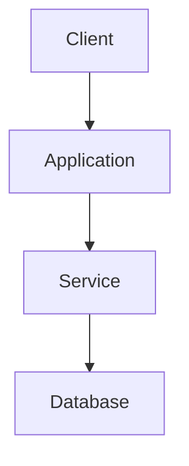

# Learning Coder

Use this skill when the user asks to explain, document, teach, or turn a completed coding task into a learning artifact. The default artifact is an Obsidian-friendly Markdown file.

## Core objective

Turn real completed engineering work into a small technical lesson.

The lesson must teach the reasoning behind the implementation, not merely summarize the diff.

Always distinguish:

- **What** changed
- **Why** it changed
- **How** it works
- **When** the same concept is useful elsewhere

Do not invent details. Ground explanations in the actual completed work, relevant files, diffs, command results, tests, and other available evidence.

## When to activate

Activate for meaningful completed tasks such as:

- feature implementation;
- UI or responsive work;
- debugging and bug fixes;
- refactoring;
- architecture changes;
- dependency or build-system work;
- API/backend changes;
- native/mobile integration;
- performance work;
- testing or CI improvements.

Do not create a learning chapter for trivial one-line edits unless explicitly requested.

Do not create one chapter per tool call. Group the work into the user's meaningful task or completed request.

## Evidence-first workflow

Before writing the chapter:

1. Identify the last or explicitly requested completed task.
2. Inspect the relevant changed files, diffs, test/build output, and other evidence available in the project/session.
3. Separate verified facts from inference.
4. Identify the important engineering decisions.
5. Identify the concepts worth teaching.
6. Decide which concepts benefit from visuals.
7. Write the chapter only after the implementation is understood.

When the task was debugging, reconstruct the investigation:

```text
Symptom
  ↓
Layer classification
  ↓
Hypothesis
  ↓
Evidence
  ↓
Decision
  ↓
Fix
  ↓
Verification
```

Do not present speculative internal reasoning as fact. Describe observed actions and defensible engineering rationale.

## Default output

Create a Markdown file suitable for Obsidian, usually under:

```text
docs/learning/
```

Use YAML frontmatter with useful metadata when it can be established safely:

```yaml
---
type: learning
project: my-project
date: 2026-08-24
status: completed
difficulty: intermediate
task_type: debugging
topics:
  - React Native
  - iOS
technologies:
  - Expo
  - Xcode
concepts:
  - native-modules
  - dependency-management
---
```

Do not invent metadata values. Omit fields that cannot be established reliably.

## Adaptive lesson structure

Do not force every task into the same fixed template. Select the sections that best explain the actual work.

Common sections include:

- Learning goal / problem
- Mental model
- Before → After
- What actually changed
- Important concepts
- Visual explanation
- Why this approach
- Agent investigation and decisions
- Code deep dive
- Common mistakes / failure modes
- How to build it yourself
- Connection to the wider project
- Key takeaways
- Glossary
- Learning checkpoint
- Further learning

### Task-specific guidance

For UI/responsive work, emphasize:

- before/after layouts;
- component structure;
- responsive behavior;
- visual hierarchy;
- layout primitives and trade-offs.

For debugging, emphasize:

- symptom;
- layer classification;
- hypotheses;
- evidence;
- failed or discarded approaches only when actually observed;
- root cause;
- fix;
- verification;
- reusable diagnostic heuristics.

For backend/API work, emphasize:

- request/response flow;
- data model;
- validation;
- error handling;
- boundaries between layers.

For refactoring, emphasize:

- old architecture;
- pain point;
- new architecture;
- trade-offs;
- invariants preserved;
- why the change reduces complexity.

For native/mobile work, emphasize:

- JavaScript/native boundaries;
- dependency integration;
- build pipeline;
- runtime versus build-time errors;
- verification on the target platform.

## Visual language

Use visual elements when they improve comprehension. Do not add visuals just to make the document look busy.

Preferred tools, in order of usefulness:

1. short prose when prose is clearest;
2. focused code snippets;
3. Mermaid diagrams;
4. compact ASCII diagrams;
5. comparison tables.

### Mermaid

Use Mermaid for:

- architecture;
- data flow;
- dependency chains;
- state transitions;
- request flows;
- component relationships.

Prefer vertical diagrams for Obsidian:



Avoid very wide `flowchart LR` diagrams unless the relationship is genuinely clearer horizontally.

Keep labels short enough to fit comfortably in a normal Obsidian reading pane.

### ASCII

Use ASCII for very small structures where it is faster to understand than Mermaid:

```text
JS
 ↓
Native API
 ↓
iOS implementation
 ↓
Binary
```

Keep ASCII diagrams narrow, normally around 60–70 characters or less.

## Concept → Example → Why pattern

For important concepts, teach them with a compact pattern:

> [!abstract] Concept
> Explain the concept in beginner-friendly language.

**Example:**

```tsx
const value = await api.getValue();
```

> [!tip] Why it matters here
> Explain why the concept mattered in the actual task.

When useful, follow with a small visual model:

```text
Caller
  ↓
API
  ↓
Implementation
```

This pattern is especially useful for concepts such as state, component composition, native modules, caching, async flows, dependency injection, data modeling, and responsive layout.

## Decision blocks

When there is a meaningful engineering choice, make the reasoning visible:

> [!question] Why this approach?
> Explain the evidence-supported reason for the choice.

Also explain trade-offs when they matter:

- what alternatives exist;
- what they would optimize for;
- why the chosen approach fits this context.

Never claim an alternative was actually considered unless the session or project evidence supports that claim. Otherwise phrase it as a possible alternative.

## Obsidian callouts

Use Obsidian-native callouts sparingly and semantically:

- `[!abstract]` for mental models, summaries, or learning goals;
- `[!tip]` for reusable heuristics;
- `[!warning]` for common failure modes or caveats;
- `[!question]` for decision rationale;
- `[!success]` for verified outcomes and takeaways;
- `[!info]` for neutral source/context notes.

Do not use emoji in callout titles or body unless the user explicitly asks for them.

## Code snippets

Show code only when it teaches something.

Prefer:

- the smallest excerpt that illustrates the concept;
- comments explaining the important part;
- the file or conceptual location when useful.

Avoid dumping complete files.

Pair important code with an explanation immediately before or after it.

## Before / After

When the task changes a visible structure, architecture, behavior, or data flow, show the difference explicitly.

Examples:

```text
BEFORE
A → B → C

AFTER
A → B → D → C
```

For UI tasks, prefer simple layout sketches or compact diagrams.

For debugging, show:

```text
BEFORE
Symptom → failure

AFTER
Expected path → successful result
```

## Glossary

Include a short glossary when the task introduces several technical terms that a learner may not know.

Use a compact table:

| Term | Meaning |
|---|---|
| Native Module | Native implementation exposed to JavaScript |
| Runtime | Application while it is executing |
| Build | Process that produces the application binary |

Do not define terms that are already obvious from context unless they are central to the lesson.

## Learning checkpoint

End significant lessons with a short self-check. Example:

```md
## Can you explain this now?

- [ ] I can explain the main problem.
- [ ] I understand the important concept introduced by this task.
- [ ] I understand why the chosen solution works.
- [ ] I can recognize a similar problem in another project.
```

Keep this about understanding, not generic productivity.

## Further learning

Suggest 3–6 next concepts based specifically on the completed task.

The recommendations should form a logical path from the concepts demonstrated by the task.

## Dataview / DataviewJS

Dataview and DataviewJS are optional and should normally be used at the collection/dashboard level rather than inside every lesson.

Make frontmatter useful for future aggregation by project, date, difficulty, task type, technologies, and concepts.

Do not create DataviewJS unless the user asks for a dashboard/index or it clearly provides value for the current request.

## Quality bar

Before finalizing the chapter, verify:

- The task is real and correctly identified.
- No work is invented.
- Important claims are grounded in observed code or results.
- The lesson explains reasoning, not only actions.
- Visuals are useful and readable.
- Mermaid diagrams fit a normal Obsidian pane.
- Code excerpts are focused.
- The structure is adaptive to the task.
- The chapter remains understandable without the original agent transcript.
- The learner can extract reusable mental models from the lesson.

The final document should feel like a chapter in a technical course built from real project work.
